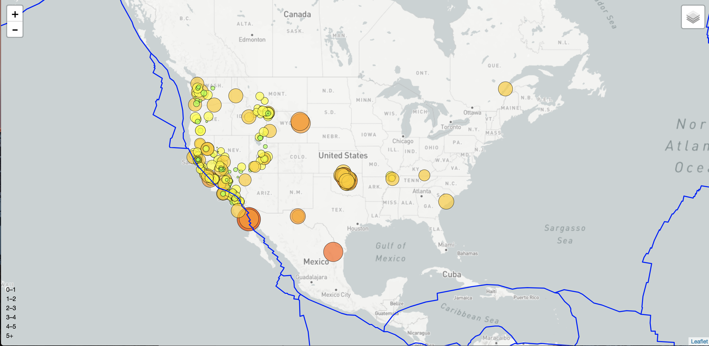
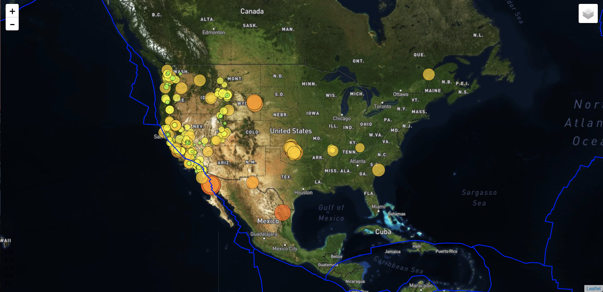

# Visualization_Data_Leaflet

## Introduction
Welcome to the United States Geological Survey, or USGS for short! The USGS is responsible for providing scientific data about natural hazards, the health of our ecosystems and environment; and the impacts of climate and land-use change. Their scientists develop new methods and tools to supply timely, relevant, and useful information about the Earth and its processes.

The USGS is interested in building a new set of tools that will allow them visualize their earthquake data. They collect a massive amount of data from all over the world each day, but they lack a meaningful way of displaying it. Their hope is that being able to visualize their data will allow them to better educate the public and other government organizations (and hopefully secure more funding..) on issues facing our planet.

I was responsible for developing below Leaflet maps that plots all of the earthquakes (from latest 7 days) data set based on their longitude and latitude using [USGS GeoJSON Feed](http://earthquake.usgs.gov/earthquakes/feed/v1.0/geojson.php).

### Step 1: Basic Visualization

* Here data markers're reflecting the magnitude of earthquake in their size and color. Earthquakes with higher magnitudes are appearing larger and darker in color.

* Incorporated popups that provide additional information about the earthquake when a marker is clicked.

* Created a legend that will provide context for your map data.

### Step 2: More Data

Here i was plotting a second data set on map to illustrate the relationship between tectonic plates and seismic activity.

In this step..

* Plotting a second data set on the map.

* Adding a number of base maps to choose from as well as separate out our two different data sets into overlays that can be turned on and off independently.

* Adding layer controls to the map.
